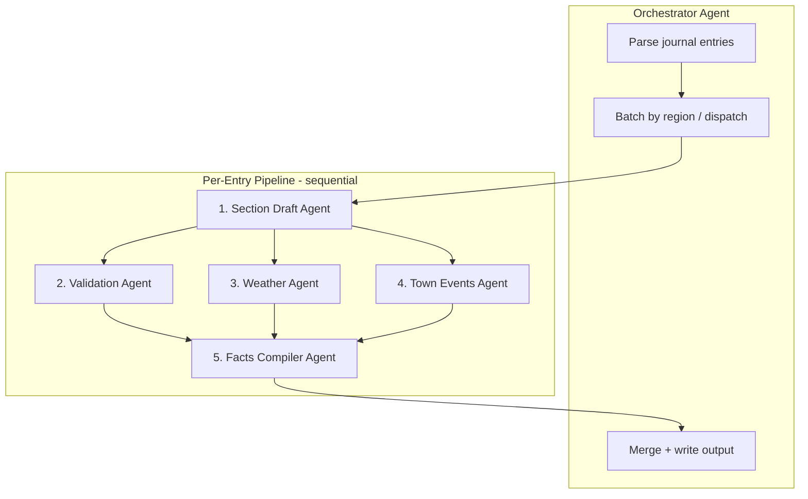

# Journal Frontmatter Facts Implementation Plan

> **For agentic workers:** REQUIRED SUB-SKILL: Use superpowers:subagent-driven-development (recommended) or superpowers:executing-plans to implement this plan task-by-task. Steps use checkbox (`- [ ]`) syntax for tracking.

**Goal:** Add YAML frontmatter `facts` blocks to each journal entry with validated, location- and date-specific details (trail section character, historical weather, town events) produced by a multi-pass subagent research pipeline.

**Architecture:** An orchestrator script parses journal entries and dispatches specialized subagents per entry (or per geographic batch). Each entry flows through four research passes—draft, validate, enrich (weather + town events), compile—before frontmatter is injected. All intermediate results are cached to JSON so the pipeline is resumable and auditable.

**Tech Stack:** Python 3, existing `parse_entry_metadata()` from `scripts/enhance_entries.py`, AWS Bedrock (draft/synthesis), Firecrawl CLI (web validation), Open-Meteo Historical Weather API (free, no key), optional Visual Crossing for backup weather, PyYAML, pytest.

---

## Problem Statement

The current `enhance_entries.py` appends unvalidated LLM prose (`Trail Facts: ...`) at the **end** of each entry. The book project needs **frontmatter** at the **top** of each entry with structured, verifiable facts:

```markdown
---
date: 2010-02-07
start: Hike Inn
destination: Hawk Mountain Shelter
miles_today: 9
trip_miles: 9
facts:
  weather: "High 42°F, low 26°F. Snow and ice; aftermath of a recent ice storm."
  trail_section: "Northern Georgia approach to Springer. Rhododendron ravines and 300-year-old hemlocks. Steep, rocky descent to Hawk Mountain."
  town_events: null
  confidence: high
  sources:
    - "Open-Meteo archive, coords 34.62,-84.19"
    - "AT Guide: Springer to Hawk Mountain section"
---

# Sunday, February 07, 2010 — Hawk Mountain Shelter
**Start Location:** Hike Inn
...
```

Each fact must be **researched**, not hallucinated. The pipeline uses subagents with narrow scopes.

---

## Subagent Architecture



### Agent Roles

| Agent | Input | Output | Tools |
|-------|-------|--------|-------|
| **Orchestrator** | `journal_10467.txt` | `journal_10467_facts.txt` + cache dir | Python, progress JSON |
| **Section Draft** | `{date, start, destination, miles}` | Structured draft JSON with trail claims | Bedrock (structured JSON mode) |
| **Validation** | Draft claims list | Verified/rejected claims + source URLs | Firecrawl search/scrape |
| **Weather** | `{date, lat, lon}` or nearest town | `{high_f, low_f, conditions, precip}` | Open-Meteo Historical API |
| **Town Events** | `{date, town_name}` (if town day) | Event string or null | Firecrawl search |
| **Facts Compiler** | All pass outputs | Final frontmatter YAML block | Bedrock or template merge |

### Parallelization Strategy

| Parallelism | Scope | Why |
|-------------|-------|-----|
| **Across entries** | Up to 10 concurrent entry pipelines | Entries are independent; cache keyed by `entry_key` |
| **Within entry** | Weather ∥ Town Events ∥ Validation (after draft) | No shared state between these three |
| **Across regions** | Section Draft batches share AT section context | GA entries can warm-cache "Springer approach" lore |

**Do NOT parallelize:** Draft → Validation (validation needs draft claims). Compiler must wait for all three enrichers.

### Subagent Dispatch Pattern

Each subagent receives a **self-contained prompt** with:
1. The entry metadata JSON
2. Its specific task and output JSON schema
3. Constraints ("only return claims you found a source for")
4. Cache file path to read/write

Example dispatch (Validation Agent):

```
You are the Validation Agent for AT journal fact-checking.

Entry:
  date: 2010-02-07
  start: Hike Inn
  destination: Hawk Mountain Shelter

Draft claims to verify:
  - "Hawk Mountain Shelter is 9 miles north of Springer Mountain"
  - "Section features old-growth hemlocks over 300 years old"
  - "Trail had ice storm debris in February 2010"

For each claim:
1. Search TrailJournals, Wikipedia, ATC, AWOL guide, hiking blogs via firecrawl
2. Mark verified (with URL) or unverified
3. Suggest corrected wording if partially true

Return JSON only:
{
  "verified": [{"claim": "...", "source": "https://...", "confidence": "high"}],
  "rejected": [{"claim": "...", "reason": "no source found"}],
  "corrections": [{"original": "...", "corrected": "..."}]
}
```

---

## Multi-Pass Research Pipeline (Per Entry)

### Pass 0: Prerequisites (Orchestrator, once)

- [ ] Extract journal: `make journal JOURNAL_ID=10467`
- [ ] Build AT location resolver: map shelter/town names → approximate lat/lon
- [ ] Detect "town days" via regex/heuristic (see Town Detection below)

### Pass 1: Section Draft (Section Draft Agent)

**Purpose:** Generate *candidate* facts from LLM trail knowledge. These are hypotheses, not final copy.

**Prompt focus:**
- Geographic context (state, elevation range, notable landmarks between A and B)
- Section reputation ("known for rock scrambles", "notorious PUDs")
- Seasonal context for that date (early Feb in GA = winter conditions, short days)
- Output as structured JSON, not prose

**Output schema (`draft.json`):**
```json
{
  "trail_section_summary": "2-3 sentence draft",
  "claims": [
    {"type": "landmark", "text": "Springer Mountain southern terminus plaque"},
    {"type": "terrain", "text": "steep icy descent from Springer in winter"},
    {"type": "flora", "text": "old-growth hemlock ravine between shelters"}
  ],
  "at_mile_start": 0.0,
  "at_mile_end": 9.0,
  "state": "GA",
  "nearest_town": "Dahlonega"
}
```

### Pass 2: Validation (Validation Agent)

**Purpose:** Verify or reject each claim from Pass 1 using web sources.

**Search targets (priority order):**
1. `site:appalachiantrail.org` + landmark name
2. `site:trailjournals.com` + shelter name
3. AWOL / White Blaze / hiking blogs
4. Wikipedia for towns and peaks

**Rules:**
- Drop claims with no corroborating source
- Prefer ATC and established guide sources over random blogs
- Record source URL for every surviving claim
- Flag `confidence: low` if only one weak source

### Pass 3a: Weather (Weather Agent)

**Purpose:** Historical weather for the hike date at the trail section.

**Steps:**
1. Resolve coordinates: midpoint of start/end locations (from location resolver)
2. Query Open-Meteo Historical API:
   ```
   GET https://archive-api.open-meteo.com/v1/archive
     ?latitude={lat}&longitude={lon}
     &start_date={date}&end_date={date}
     &daily=temperature_2m_max,temperature_2m_min,precipitation_sum,weathercode
     &temperature_unit=fahrenheit
     &precipitation_unit=inch
   ```
3. Map WMO weather codes to human text ("snow and rain mix", "clear and cold")
4. Note station distance caveat if coords are approximate

**Fallback:** Visual Crossing or NOAA GHCN if Open-Meteo returns gaps.

**Output:**
```json
{
  "high_f": 42,
  "low_f": 26,
  "precip_in": 0.3,
  "conditions": "snow and rain mix",
  "source": "open-meteo",
  "coords": [34.62, -84.19],
  "caveat": "Grid cell midpoint; nearest town Dahlonega ~15mi"
}
```

### Pass 3b: Town Events (Town Events Agent, conditional)

**Trigger:** `is_town_day(entry)` returns true.

**Town detection heuristics:**
- Destination or start contains: `Motel`, `Hostel`, `Inn`, `Lodge`, `Hotel`, `town`, `village`
- Parenthetical town name: `EconoLodge Motel (Helen, GA)`
- `miles_today == 0` (zero days often = town stay)

**Search queries:**
- `"{town} {state}" "{Month Day Year}" events`
- `"{town}" parade OR festival OR "town event" 2010`
- Local newspaper archives if findable

**Rules:**
- Return `null` if nothing found (don't invent parades)
- Include event only with a dated source
- For 2010, expect sparse results—`confidence: low` is acceptable

### Pass 4: Compile (Facts Compiler Agent)

**Purpose:** Merge validated outputs into concise frontmatter strings.

**Inputs:** `draft.json`, `validation.json`, `weather.json`, `town_events.json`

**Output rules:**
- `facts.weather`: one sentence, e.g. `"High 76°F, low 33°F. Snow and rain mix."`
- `facts.trail_section`: 1-2 sentences from **verified** claims only
- `facts.town_events`: string or `null`
- `facts.confidence`: `high` | `medium` | `low` (lowest of component confidences)
- `facts.sources`: deduplicated URL list

**Template (no LLM needed if structured):**
```python
def compile_facts(validation, weather, town_events) -> dict:
    weather_str = f"High {weather['high_f']}°F, low {weather['low_f']}°F. {weather['conditions']}."
    trail_str = " ".join(c["text"] for c in validation["verified"] if c["type"] != "weather"])
    return {
        "weather": weather_str,
        "trail_section": trail_str[:500],  # cap length
        "town_events": town_events.get("event"),
        "confidence": min_confidence(validation, weather, town_events),
        "sources": collect_sources(validation, weather, town_events),
    }
```

LLM compiler optional for prose polish—but only after facts are locked.

---

## File Structure

```
scripts/
  enhance_entries.py          # existing; keep for context mode
  enrich_facts.py             # NEW: orchestrator CLI
  facts/
    __init__.py
    models.py                 # EntryMetadata, DraftFacts, ValidatedFacts, Frontmatter
    location_resolver.py      # shelter/town → lat/lon (static JSON + fuzzy match)
    draft_agent.py              # Bedrock structured draft
    validate_agent.py           # Firecrawl validation wrapper
    weather_agent.py            # Open-Meteo client
    town_events_agent.py        # Firecrawl town search
    compiler.py                 # Merge → frontmatter YAML
    frontmatter.py              # inject YAML into entry text
    cache.py                    # read/write per-entry pass cache
    orchestrator.py             # batch dispatch, resume, parallel limits

data/
  at_locations.json             # ~200 common AT shelters/towns with lat/lon

tests/
  test_facts_models.py
  test_location_resolver.py
  test_weather_agent.py
  test_compiler.py
  test_frontmatter.py
  fixtures/
    sample_entry.txt
    sample_draft.json
    sample_weather_response.json

cache/facts/                    # gitignored
  {entry_key}/
    draft.json
    validation.json
    weather.json
    town_events.json
    frontmatter.yaml
```

---

## Location Resolver Design

Static JSON keyed by normalized shelter/town names from your journal. Source data:
- ATC shelter list
- AWOL AT guide mile markers (manual seed for journal-specific locations)

```json
{
  "hawk mountain shelter": {"lat": 34.72, "lon": -84.12, "state": "GA", "at_mile": 8.1},
  "hike inn": {"lat": 34.68, "lon": -84.05, "state": "GA", "at_mile": 0},
  "helens, ga": {"lat": 34.70, "lon": -83.73, "state": "GA", "at_mile": 75.2, "is_town": true}
}
```

Fuzzy match: strip parentheticals, lowercase, remove "shelter"/"hostel" suffixes for lookup.

---

## Caching & Resume

Cache key: `{date}_{normalized_start}_{normalized_destination}` (reuse `get_entry_key()`).

Each pass writes atomically to `cache/facts/{entry_key}/{pass}.json`.

Orchestrator on restart:
1. List entries from journal
2. Skip entries where `frontmatter.yaml` exists and `--force` not set
3. Resume incomplete entries from last completed pass

Progress file: `cache/facts/progress.json` with `{completed: [...], failed: [...], last_index: N}`

---

## Output Format

**Enhanced journal file:** `journal_10467_facts.txt`

Each entry:
```markdown
---
date: 2010-02-07
start: Hike Inn
destination: Hawk Mountain Shelter
miles_today: 9
trip_miles: 9
facts:
  weather: "High 42°F, low 26°F. Snow and ice on trail."
  trail_section: "Northern Georgia, Springer approach. Old-growth hemlock ravines. First-day section for 2010 NOBO hikers."
  town_events: null
  confidence: medium
  sources:
    - https://archive-api.open-meteo.com/v1/archive?...
    - https://www.appalachiantrail.org/...
---

# Sunday, February 07, 2010 — Hawk Mountain Shelter
...
```

---

## Implementation Tasks

### Task 1: Data Models & Location Resolver

**Files:**
- Create: `scripts/facts/models.py`
- Create: `scripts/facts/location_resolver.py`
- Create: `data/at_locations.json` (seed ~30 locations from journal index)
- Create: `tests/test_location_resolver.py`

- [ ] **Step 1:** Define Pydantic-style dataclasses or TypedDicts for pipeline stages
- [ ] **Step 2:** Seed `at_locations.json` from journal entry table (Hike Inn through Katahdin)
- [ ] **Step 3:** Implement fuzzy lookup + town extraction from `"Motel (Helen, GA)"` patterns
- [ ] **Step 4:** Write tests for known journal locations
- [ ] **Step 5:** Commit

### Task 2: Weather Agent

**Files:**
- Create: `scripts/facts/weather_agent.py`
- Create: `tests/test_weather_agent.py`
- Create: `tests/fixtures/sample_weather_response.json`

- [ ] **Step 1:** Implement Open-Meteo client with weathercode → text mapping
- [ ] **Step 2:** Test with 2010-02-07 coords near Springer (mock HTTP)
- [ ] **Step 3:** Integration test hitting real API for one date (mark `@pytest.mark.integration`)
- [ ] **Step 4:** Commit

### Task 3: Section Draft Agent

**Files:**
- Create: `scripts/facts/draft_agent.py`
- Modify: reuse Bedrock client pattern from `enhance_entries.py`

- [ ] **Step 1:** Write structured JSON prompt (not prose)
- [ ] **Step 2:** Parse response into `DraftFacts` model
- [ ] **Step 3:** Unit test with mocked Bedrock response
- [ ] **Step 4:** Commit

### Task 4: Validation Agent

**Files:**
- Create: `scripts/facts/validate_agent.py`

- [ ] **Step 1:** Wrap Firecrawl CLI (`firecrawl search "{claim}" --scrape -o ...`)
- [ ] **Step 2:** Parse results, score source quality
- [ ] **Step 3:** Test with mocked firecrawl output
- [ ] **Step 4:** Commit

### Task 5: Town Events Agent

**Files:**
- Create: `scripts/facts/town_events_agent.py`

- [ ] **Step 1:** Implement `is_town_day()` heuristic
- [ ] **Step 2:** Firecrawl search for town + date
- [ ] **Step 3:** Return null when no sourced event found
- [ ] **Step 4:** Commit

### Task 6: Facts Compiler & Frontmatter Injection

**Files:**
- Create: `scripts/facts/compiler.py`
- Create: `scripts/facts/frontmatter.py`
- Create: `tests/test_compiler.py`, `tests/test_frontmatter.py`

- [ ] **Step 1:** Template-based compiler (deterministic, testable)
- [ ] **Step 2:** YAML frontmatter generator with `---` delimiters
- [ ] **Step 3:** Inject frontmatter before `# {date}` header
- [ ] **Step 4:** Round-trip test: parse → inject → parse metadata unchanged
- [ ] **Step 5:** Commit

### Task 7: Cache Layer

**Files:**
- Create: `scripts/facts/cache.py`

- [ ] **Step 1:** Per-entry pass read/write with atomic temp files
- [ ] **Step 2:** Resume logic (skip completed passes)
- [ ] **Step 3:** Test resume after simulated crash
- [ ] **Step 4:** Commit

### Task 8: Orchestrator & CLI

**Files:**
- Create: `scripts/facts/orchestrator.py`
- Create: `scripts/enrich_facts.py`
- Modify: `Makefile` (add `make enrich-facts`)
- Modify: `.gitignore` (add `cache/facts/`, `.firecrawl/`)

- [ ] **Step 1:** CLI: `python scripts/enrich_facts.py journal_10467.txt --cache cache/facts`
- [ ] **Step 2:** Sequential pipeline for one entry (debug mode)
- [ ] **Step 3:** Parallel entry dispatch with `--workers 5`
- [ ] **Step 4:** Makefile target + README section
- [ ] **Step 5:** Commit

### Task 9: Pilot Run (10 entries)

- [ ] **Step 1:** Run on first 10 journal entries
- [ ] **Step 2:** Human review sample output for accuracy
- [ ] **Step 3:** Tune prompts and town detection based on review
- [ ] **Step 4:** Commit prompt/config adjustments

### Task 10: Full Journal Run

- [ ] **Step 1:** Run all ~133 entries with `--workers 8`
- [ ] **Step 2:** Review low-confidence entries
- [ ] **Step 3:** Produce `journal_10467_facts.txt`
- [ ] **Step 4:** Commit cache is NOT committed; output file optional in repo

---

## Subagent Execution Schedule (Runtime)

When running the full journal, the **Orchestrator** dispatches subagents in waves:

| Wave | Subagents | Count | Notes |
|------|-----------|-------|-------|
| W0 | Location Resolver (batch) | 1 | Pre-resolve all 133 start/end → coords |
| W1 | Section Draft | 10 parallel | One per entry batch of 13 |
| W2 | Validation + Weather + Town | 30 parallel | 3 per entry × 10 entries |
| W3 | Facts Compiler | 10 parallel | After W2 completes per entry |
| W4 | Review Agent | 1 | Spot-check 5 random entries for quality |

**Estimated API calls:** ~133 entries × (1 Bedrock draft + 3-5 Firecrawl searches + 1 weather + 0-1 town) ≈ 700-900 calls.

**Rate limits:** 1s sleep between Bedrock calls; Firecrawl up to concurrency limit from `firecrawl --status`.

---

## Risks & Mitigations

| Risk | Mitigation |
|------|------------|
| LLM invents facts | Validation pass required; compiler drops unverified claims |
| 2010 weather unavailable at exact trail coords | Use nearest grid point; add caveat in sources |
| Town events not findable for 2010 | Return `null`; don't fabricate |
| 133 entries × Firecrawl = cost/time | Cache aggressively; `--entries 1-10` for pilot |
| Shelter name ambiguity ("A cabin (NOC)") | Location resolver fuzzy match + manual overrides file |
| Bedrock unavailable | Fall back to draft-only mode with `confidence: low` flag |

---

## Testing Strategy

| Level | What |
|-------|------|
| Unit | Each agent with mocked HTTP/Bedrock/Firecrawl |
| Integration | One real entry end-to-end (Feb 7 2010) |
| Snapshot | Frontmatter YAML structure stable across runs |
| Human | Review pilot 10 for factual accuracy |

---

## Makefile Addition

```makefile
enrich-facts: $(VENV)/bin/activate
	@if [ ! -f "$(JOURNAL_FILE)" ]; then \
		echo "Error: $(JOURNAL_FILE) not found. Run 'make journal' first."; \
		exit 1; \
	fi
	$(PYTHON) scripts/enrich_facts.py $(JOURNAL_FILE) \
		--output journal_$(JOURNAL_ID)_facts.txt \
		--cache cache/facts \
		--workers 5
```

---

## Self-Review (Spec Coverage)

| Requirement | Task |
|-------------|------|
| Frontmatter on each post | Task 6 |
| Location/time-specific facts | Tasks 1, 3, 4 |
| Weather (high/low, conditions) | Task 2 |
| Town events when passing through | Task 5 |
| Draft from training data | Task 3 |
| Validate then search | Task 4 |
| Extra searches | Tasks 4, 5 |
| Many steps / resumable | Tasks 7, 8 |
| Subagent architecture | This document § Subagent Architecture |

No placeholder tasks. All file paths specified.

---

## Execution Handoff

**Plan complete and saved to `docs/superpowers/plans/2026-07-09-journal-frontmatter-facts.md`.**

**Two execution options:**

1. **Subagent-Driven (recommended)** — Dispatch a fresh subagent per implementation task (Tasks 1–10), with review between tasks. Best for building the pipeline incrementally with quality gates.

2. **Pilot-First** — Implement Tasks 1–8 minimally, then run Task 9 (10 entries) before completing Task 10. Validates the research quality before burning API credits on all 133 entries.

**Recommended first step:** Task 1 (location resolver) + Task 2 (weather agent), then a manual pilot on your Feb 7, 2010 entry to validate output quality before building validation/town agents.
